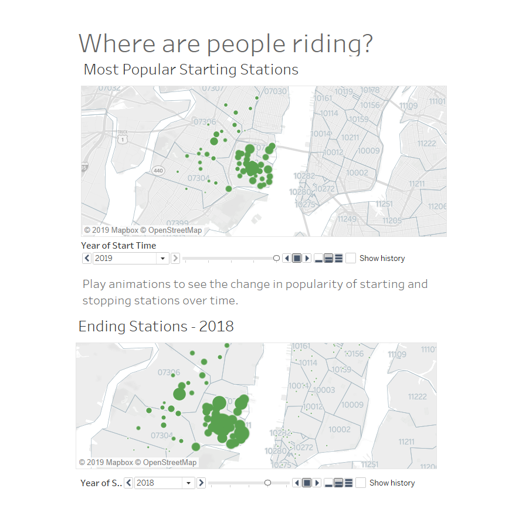
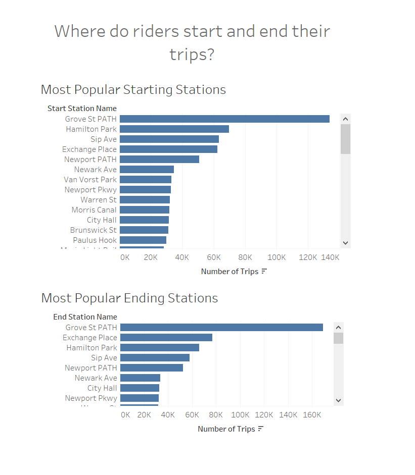
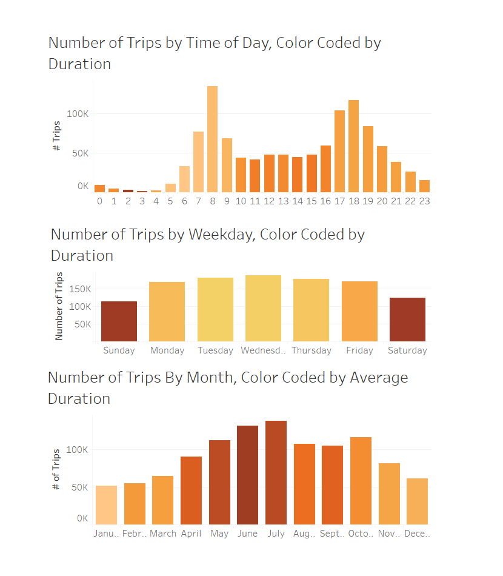
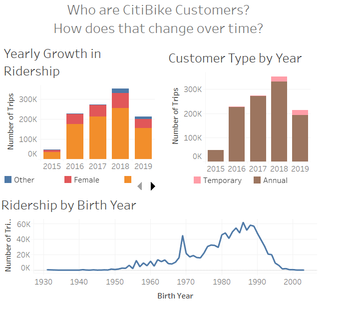
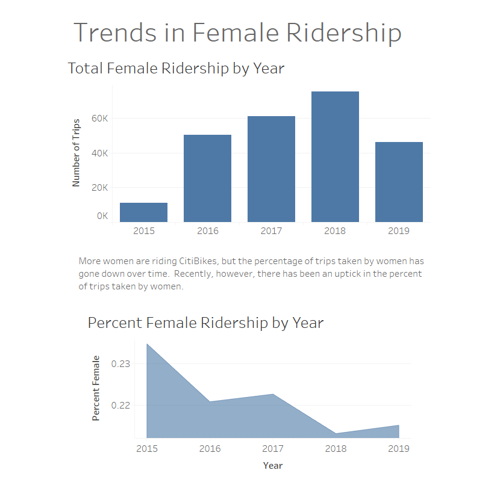
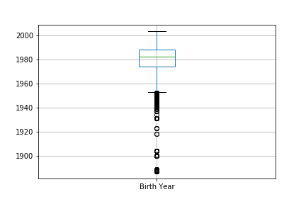
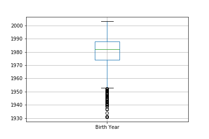
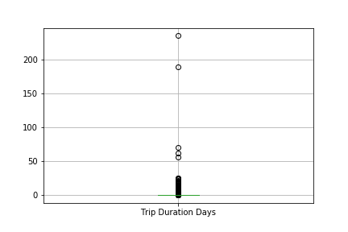
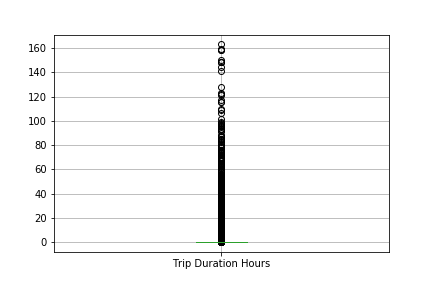

# Analysis of CitiBike Data Using Python and Tabeau

We downloaded data from [Citi Bike Data](https://www.citibikenyc.com/system-data) webpage in order to perform basic analyses and visualizations detailing ridership trends.  Screenshots and discussion are provided in this read-me file, but we encourage you to check out some of the interactive features on the [Tableau Workbook](https://public.tableau.com/profile/maria.hudson#!/vizhome/TableauHomework_15690719988790/TripTimingDashboard).

## Location of Trips
See the [Trip Location Dashboard](https://public.tableau.com/profile/maria.hudson#!/vizhome/TableauHomework_15690719988790/LocationDashboard) for interactive maps of the popularity of [starting](https://public.tableau.com/profile/maria.hudson#!/vizhome/TableauHomework_15690719988790/StartingStationsRanked) and [ending](https://public.tableau.com/profile/maria.hudson#!/vizhome/TableauHomework_15690719988790/EndingStationsRanked) stations.  You can select the year you are most interested in or click on individual stations for more details.  

We also provided [ranked lists](https://public.tableau.com/profile/maria.hudson#!/vizhome/TableauHomework_15690719988790/RankedLocationDashboard) of the most popular starting and ending stations.

## Timing of Trips
CitiBike definitely ejoys the benefits of better temperatures.  [Ridership increases during the warmer months](https://public.tableau.com/profile/maria.hudson#!/vizhome/TableauHomework_15690719988790/TripsbyMonth) by a great deal-- both in number of trips and in duration of trips.  The [variation by time of day](https://public.tableau.com/profile/maria.hudson#!/vizhome/TableauHomework_15690719988790/TripsbyTimeofDay), shows a different pattern. The number of rides spikes between 7 and 9 AM and again between 5 and 7 PM, indicating that many people use CitiBike to commute.  The duration of the rides, however, are longer in the midday, indicating that some are using CitiBike for sight-seeing in the midday.  Oddly, middle-of-the-night trips average a longer duration than any other time of day.  (We decided not to look to deeply into that.)  [Weekdays](https://public.tableau.com/profile/maria.hudson#!/vizhome/TableauHomework_15690719988790/RidershipbyWeekday) see higer ride volume than weekends, but the duration of those rides are longer.  The [Trip Timing Dashboard](https://public.tableau.com/profile/maria.hudson#!/vizhome/TableauHomework_15690719988790/TripTimingDashboard) shows these visualizations side-by-side.  Note that darker colors indicate longer ride durations.

## Rider Characteristics
Check out the [Customer Traits Dashboard](https://public.tableau.com/profile/maria.hudson#!/vizhome/TableauHomework_15690719988790/CustomerTraitsDashboard) for an overview of traits such as gender, birth year, and type of customer.  

In particular, there was an interest in [Female Ridership](https://public.tableau.com/profile/maria.hudson#!/vizhome/TableauHomework_15690719988790/FemaleRidershipDashboard).  We noted that there has been a marked increase in total female ridership, but the trend is not the same for the percentage of female ridership.  Since 2016 there has been a downward trend in the percentage of rides taken by women. However, as of summer 2019, there is an increase in the share of rides by women that could indicate successful outreach programs.

## A note about data cleaning
We downloaded trip data from September 2015 through July 2019 as well as daily sales data from 2013 through 2019. Due to timing constraints and major changes to the daily data, we decided to focus our analysis only on trip data.  We imported the data and standardized column names.

We also created a handful of convenience variables, such as male and female indicators and converted ride durations to both hours and days to investgate outliers and allow for more understandable output.  

Our initial analysis showed several instances of unreliable data.  There was data indicating a bicycle station off the cost of Africa, for example.  We restricted our analysis to longitude and latitude coordinates within 150 miles of New York City.

We also noted many centenarians riding CitiBikes that looked a bit suspicious.  We ran a box-plot of age to determine which were likely to be outlier, fictitious or erroneous ages and saw the following distribution of bith year.

We made the decision to remove all customers born before 1930. While it's possible we removed a valid nonagenarian or two, bicycle-riding nonagenarians are certainly outliers.  The distribution of birth year after this subset is below.

While we still believe there is erroneous data in the cleaned dataframe, we did not want to exclude too much data from consideration.  We recommend further analysis to determine other methods of cleaning birth year data.  One anecdotal observation is an extremely unexpected frequency of the birth year 1969.  We also noted lower than expected birth years for early-20-somethings and can only assume that someone is giggling somewhere.

Our last bit of data cleaning involved trip duration.  We noticed that there were some extremely long trips in the database-- one lasting nearly a year.  Again, we used a box plot to determine a reasonable cut-off for trip duration.  Below is the plot of trip duration (in hours) prior to data cleaning.

We decided to remove trips lasting more than a week as these were more clearly erroneous or outlier data points.  The box-plot of duration after cleaning shows that the vast majority of trips are short, lasting only a few hours, but there are some cases of multi-day rides that appear to be valid data.

Prior to data cleaning, we had 1,163,501 trip records.  We removed 45,752 using the above-described logic. This left us a total of 1,117,749 CitiBike trips to use in our analysis.

